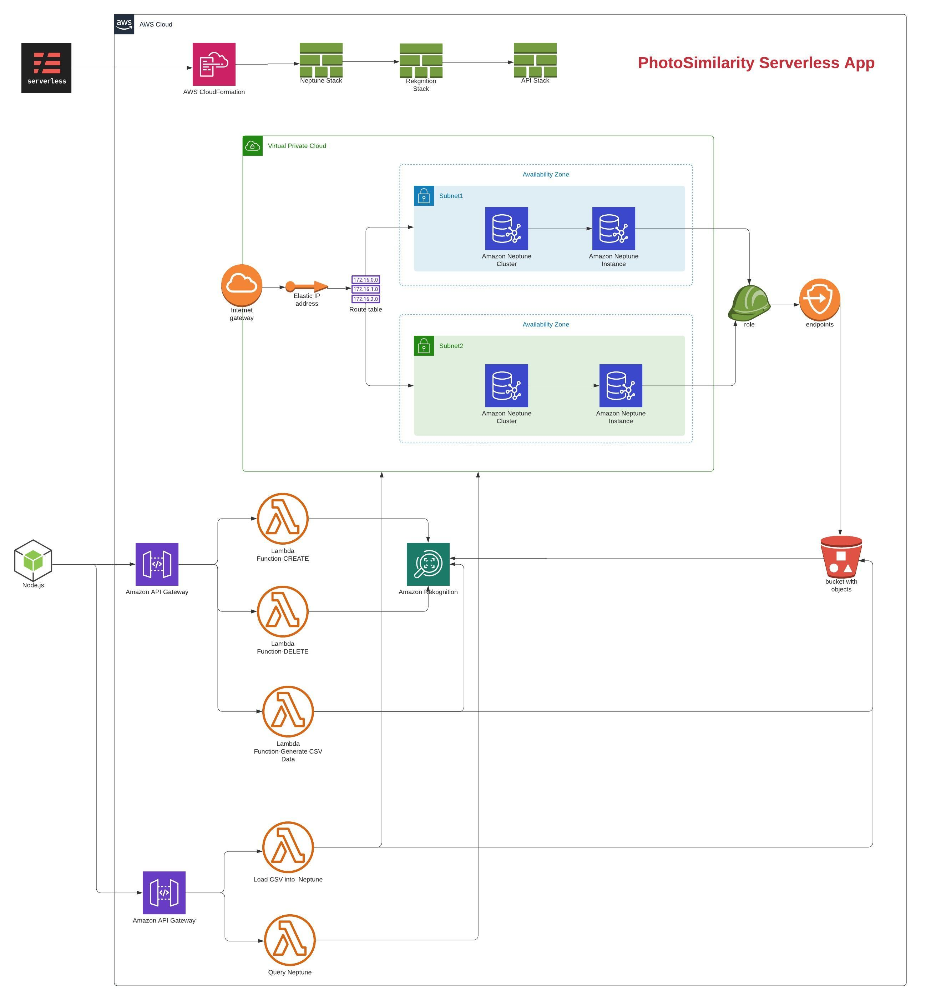
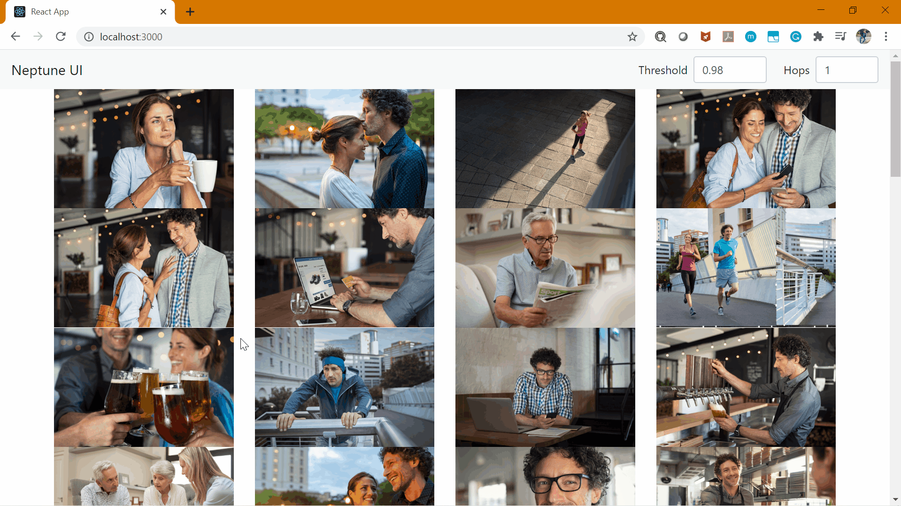

# AWS_PhotoSimilarity
This project is created to identify and provide similar faces recommendation based on AWS Serverless and Neptune Graph DB.

## Features:
### Neptune Stack
  - VPC creation with two Subnet for high availability.
  - Network Security Group and Route Table to open HTTPs call to Neptune Cluster.
  - Internet Gateway and an Elastic IP.
  - Neptune Database Cluster and Neptune DB Instance.
  - VPC Endpoint for Neptune to access S3 data files.
  - Output Cluster Details and IAM roles to API Stack.

### Rekognition Stack
  - S3 bucket name creation using shortUuid and dotEnv modules.
  - Lambda Function with API Gateway to create an rekognition collection for image processing.
  - Lambda Function with API Gateway to delete an rekognition collection.
  - Lambda Function to process images (indexFaces and searchFaces utility of rekognition) and save Node and Edge   details into CSV format for Neptune DB.
  - APl Gateway to trigger Lambda function when a new image gets uploaded.
  - Lambda function with API Gateway to provide list of photos from S3 bucket.
  - Output S3 bucket name for API Stack.

### API Stack
  - Query Lambda Function to run parameterised Graph Queries using Gremlin against Neptune Instance.
  - API Gateway for Query Lambda Function to pass through Query Parameter String.
  - Loader Lambda Function to load CSV files created by Rekognition Stack Lambda Function into Neptune DB.

### UI
  - Create Front-End Application based on Node and React.
  - Call List Lambda function of rekognition Stack to load S3 Image files.
  - Call Query Lambda Function of API Stack to find similar photos list based on given threshold and hops.

## Setup:
  - Run npm install in each stack to load Node modules.
  - Serverless deploy in Neptune Stack first.
  - Serverless deploy in Rekognition Stack.
  - Serverless deploy in API Stack.
  - Manual Step: Attach created IAM role to Neptune DB from Front End.
  - Use Serverless and run Create collection Lambda function.
  - Upload Image to S3 bucket and make them public.
  - Run npm install inside UI folder.
  - Update App.js with Gateway base URLs and S3 bucket name.
  - Run npm start
  - Application is up and running.

## Architecture Diagram:

## Application:

